# 记录 2022-06

TODO:需要花时间整理一下工程，主要是核间通信和e907的代码

2022-06-xx~28

---

IO18_SPI_MOSI
IO40_SPI_CS
IO13_SPI_MISO
IO7_SPI_SCLK(跟屏幕SPI共用)


IO18_SPI_MISO
IO40_SPI_CS
IO6_SPI_MOSI
IO7_SPI_SCLK(跟屏幕SPI共用)


软排线长度40cm/根

接线方式：5cm软排线+N*40cm软排线

过程：

- SPI频率40MHz，接2根后，黑屏（但背光亮，所以不是连接问题）
- SPI频率20MHz，接5根后，出现花屏
- SPI频率10MHz，接10根后，出现花屏

结果：

- SPI频率40MHz，支持45cm
- SPI频率20MHz，支持165cm
- SPI频率10MHz，支持365cm

注：

​	排线过长后容易受到外界环境干扰


摄像头类型

识别距离：

- 直线距离（人脸左右倾斜，上下旋转、左右旋转）
- 斜线距离（身高）

环境影响：

- （红外）背光
- （可见光）背光，阴暗处

识别效果：

- 环境和距离的识别成功率


906剩5M

907剩0.4M

未分配30M

总剩余35M


内存统计2022-05-25

c906

| 功能                                                         | 消耗内存 |
| ------------------------------------------------------------ | -------- |
| 任务栈<br />- camera 4096 * 4<br />- flow 4096*4<br />- uartp 256 * 4 | 33k      |
| cam_task使用的缓存                                           | 2.53M    |
| flow_task使用缓存                                            | 1.17M    |
| mf_flow<br />- 模型相关                                      | 13M      |
| mf_cam<br />- 接收双缓存                                     | 2.5M     |
| mf_facedb<br />- 人脸信息缓存（ld直接分配）<br />- 读写flash缓存 | 640k     |
| mf_lcd<br />- 图片缓存（ld直接分配）                         | 512k     |
| mf_model<br />- 模型文件（ld直接分配，这里包括了资源文件，例如图片） | 7M       |
| 总计（没有细算）                                             | 27M      |


```
(198): [cam_loop] exectime is 259378 us, 259 ms
136094 fps
(152): [rotation_rgb0_right90] exectime is 57704 us, 57 ms
(160): [reduce_rgb0] exectime is 4121 us, 4 ms
(234): [flow_loop]addr:0x00000000509c7f18 w:480 h:640 pixel:4
(241): [im_crop] exectime is 5854 us, 5 ms
(247): [img_resize] exectime is 12880 us, 12 ms
(269): [blai_getInputBuffer] exectime is 2 us, 0 ms
(275): [cpy_img_in_face_detect] exectime is 2831 us, 2 ms
(281): [blai_npu_initCfg] exectime is 4 us, 0 ms
[CPU]Total process time: 0 ms
[NPU]Total process time: 53 ms
[POST]Total process time: 0 ms
[ALL]Total process time: 53 ms
(285): [blai_startCompute] exectime is 52685 us, 52 ms
(318): [cal_fd_output] exectime is 154 us, 0 ms
(330): [cal_data_chw] exectime is 75 us, 0 ms
(335): [region_layer_run] exectime is 2018 us, 2 ms
(318): [cal_fd_output] exectime is 623 us, 0 ms
(330): [cal_data_chw] exectime is 1216 us, 1 ms
(335): [region_layer_run] exectime is 7939 us, 7 ms
total 1 faces
x:100   y:122   w:139   h:167
(108): [FACE_DETECT] exectime is 69424 us, 69 ms
(129): Find face, idx:0
(454): [cpy_img_in_face_align] exectime is 929 us, 0 ms
(460): [resize_in_face_align] exectime is 2321 us, 2 ms
(482): [cpy_img_in_point_detect] exectime is 80 us, 0 ms
(488): [blai_npu_initCfg] exectime is 4 us, 0 ms
[CPU]Total process time: 0 ms
[NPU]Total process time: 3 ms
[POST]Total process time: 0 ms
[ALL]Total process time: 3 ms
(492): [blai_startCompute] exectime is 3430 us, 3 ms
(529): [im_umeyama] exectime is 29 us, 0 ms
(533): [im_affine] exectime is 9878 us, 9 ms
(152): [FACE_ALIGN] exectime is 17931 us, 17 ms
AS started
(738): [cpy_img_in_living_detect] exectime is 81 us, 0 ms
(744): [blai_npu_initCfg] exectime is 4 us, 0 ms
[CPU]Total process time: 1 ms
[NPU]Total process time: 7 ms
[POST]Total process time: 0 ms
[ALL]Total process time: 8 ms
(748): [blai_startCompute] exectime is 8117 us, 8 ms
(580): [cpy_img_in_ftr_cal] exectime is 330 us, 0 ms
(586): [blai_npu_initCfg] exectime is 4 us, 0 ms
[BL_MallocDMA] mem_id 0, [0x0x0000000050cbc300 ~ 0x0x0000000050cbcb00], size 0x800
[BL_MallocDMA] mem_id 0, [0x0x0000000051db2e80 ~ 0x0x0000000051db3680], size 0x800
[BL_FreeDMA] addr 0x0x0000000050cbc300
[BL_FreeDMA] addr 0x0x0000000051db2e80
[CPU]Total process time: 4 ms
[NPU]Total process time: 62 ms
[POST]Total process time: 0 ms
[ALL]Total process time: 66 ms
(590): [blai_startCompute] exectime is 66053 us, 66 ms
(608): [cal_ftr] exectime is 12 us, 0 ms
(221): [FTR_CAL] exectime is 67238 us, 67 ms
(239): [DB_SEARCH] exectime is 17 us, 0 ms
(272): Recognize failed!
(273): [mf_model_run_fr] exectime is 185273 us, 185 ms
(179): [send_to_flow] exectime is 191746 us, 191 ms
(189): [send_to_uartp] exectime is 2 us, 0 ms
(243): pass:0, score:0.00, live:95.19 true:1
(248): rotate_left_and_right:right(0.00), rotate_up_and_down:down(0.00), tilt_left_and_right:right(0.00)
(195): [mf_lcd_draw] exectime is 5049 us, 5 ms
(198): [cam_loop] exectime is 259434 us, 259 ms
```


fe_pb87 512byte特征值

```
临时工 比对自身：95~98 比对雷姐：68~70
雷姐 对比自身：96~98 对比临时工：68~70

```


| 内容     | 占用大小                                                     |
| -------- | ------------------------------------------------------------ |
| boot2    | 64k                                                          |
| 906固件  | 453k                                                         |
| 907固件  | 431k                                                         |
| 数据库   | 512byte特征值，255x5人脸（每张人脸600字节，预留39字节），占用约702kb<br />256byte特征值，255x5人脸（每张人脸512字节，预留295字节），占用约638kb<br />256byte特征值，128x5人脸（每张人脸512字节，预留295字节），占用约320kb |
| 模型     | 1848k                                                        |
| 配置文件 | 1k                                                           |
| 总计     | 3117k(按128x5人数据库算)                                     |

20220615

| 内容     | 占用大小                                                     |
| -------- | ------------------------------------------------------------ |
| boot2    | 64k                                                          |
| 906固件  | 453k 分配512k                                                |
| 907固件  | 431k 分配512k                                                |
| 数据库   | 384byte特征值，128x5人脸（每张人脸分配512字节），占用约320kb |
| 模型     | 检测模型（432K）+关键点模型（248k）+活体模型（120k）+特征值模型（2.3M）= 3156K |
| 配置文件 | 1k                                                           |
| 总计     | 约4564k                                                      |


1847k


水平  距离60cm  1m ~ 1.62m

水平 距离80cm  1.21m~1.73m


功耗：

带显示屏：300mA

不带显示屏：230mA


```
KEY:112233445566778899AABBCCDDEEFF00
IV:112233445566778899AABBCC00000000
```


操作：

1. 在烧录工具填入AES KEY和IV
2. 第一次烧录，只烧录了e907固件
3. 第二次烧录，烧录了e907固件，c906固件，romfs文件，c906固件是通过D0 Firmware选项烧录
4. 发现c906没有运行，在e907打印c906固件的数据发现与原数据不一致
5. 保证固件不变，用另一块芯片进行不加密烧录，c906正常启动，e907打印的c906固件与原数据一致


加密：

```shell
# 加密
openssl enc -e -aes-128-cbc -in input.bin -out encrypt.bin -K 112233445566778899AABBCCDDEEFF00 -iv 112233445566778899AABBCC00000000 -p -nosalt

# 解密
openssl aes-128-cbc -d -in encrypt.bin -out decode.bin -K 112233445566778899AABBCCDDEEFF00 -iv 112233445566778899AABBCC00000000 -p -nosalt
```


2022-06-29

---

1. 准备解决uvc不能显示的问题

   已解决。发现是fifo_th_gc0308参数值的原因，使用uvc时需要设置为600，默认是460

2. 解决添加`jpgHeadLength = JpegHeadCreate(YUV_MODE_422, MJPEG_QUALITY, mjpeg_width, mjpeg_height, jpgHeadBuf);`代码后摄像头容易丢帧的问题

   已解决。猜测是jpgHeadBuf作为静态变量声明后，导致后续一系列变量的内存位置改变，进而导致总线访问速度变慢，dvp出图变慢。目前解决方法是为jpgHeadBuf分配动态内存

3. 实现UVC和RGB+IR切换，UVC启动时不使用IR摄像头

   已完成。需要注意切换到yuv时需要重新初始化mjpeg

4. 开始用串口协议切换UVC和识别

   已完成。

5. 细致了解一下UVC的协议，总结一下USB协议


2022-06-30

---

1. 解决黑子调试uvc的问题

   准备直接在S2上开发

2. 解决bl808 uvc固件拷机后出现撕裂的问题

   当前选择在切换后完全关闭MJPEG或RGB+IR，拷机中。。9点40开始拷机

   - 拷机期间在从uvc切换到rgb时出现系统重启
   
3. 解决fjsa的问题，小问题改下代码

4. 查找识别阈值过了识别阈值但没有框出人脸的问题

   是因为两个摄像头同时只检测到一张人脸

5. 准备验证audio


2022-07-01

---

1. 烤机发现rotation_rgb0_right90_start和rotation_rgb0_right90_wait的操作可能导致摄像头错屏，但是不能保证是否是USB_CAM固件引起的，多加几台USB_CAM固件拷机
2. 重新复现将jpgHeadBuf通过静态变量方式定义时导致屏幕错屏的问题不能复现了。下次有遇到类似问题要留下来讨论，可能是IC总线问题？

- [x] 解决思安的问题？json连续收到两个\r\n时会只进入一次回调，前一次数据丢失。

  添加串口中断回调函数，让客户能直接拿到原数据

- [ ] 跟浙江鸿利沟通识别情况

  - 跟顺义联系，等顺义跟鸿利沟通

- [x] 测试加密固件烧录

  ```shell
  # 加密
  openssl enc -e -aes-128-ctr -in bl808_demo_event.bin -out encrypt.bin -K 112233445566778899AABBCCDDEEFF00 -iv 112233445566778899AABBCC00000000 -p -nosalt
  ```

  不需要手动加密，只需要在烧录一次固件后，从烧录软件的缓存里找到烧录时缓存的固件文件，再通过Single Download Config选项烧录对应固件。缓存固件文件的位置：`flash_tool/chips/bl808/img_create_iot`

  需要烧录的固件：

  - `whole_flash_data.bin`，地址0x0，包括了boot，partition，e907固件
  - `whole_img_d0fw.bin`，地址0x90000，包括了c906固件
  - `media.bin`，地址0x1A8000，包括了romfs的文件

- [ ] 准备串口+USB的压力测试，用来解决因串口协议收发导致显示错屏的问题

- [ ] 测试audio功能

  ```c
  static int do_playback(const uint8_t *data, size_t data_len)
  {
      if (!data)
          return -1;
      audio_player_t *player = NULL;
      audio_player_get(&player);
      if (player == NULL) {
          printf("player no init \r\n");
          return -2;
      }
  
      player->fifo_start(player);
      size_t remain_len = data_len;
      size_t w_len = 0, ret = 0;
      while (remain_len > 0) {
          w_len = remain_len > 4096 ? 4096 : remain_len;
          ret = player->fifo_write(player, data + data_len - remain_len, w_len, 1); 
          remain_len -= ret;
      }
      player->fifo_stop(player, 0);
      return 0;
  }
  
  ```

  

USB协议记录

---


   >#### USB协议
   >
   >参考的文章：
   >
   >https://zhuanlan.zhihu.com/p/464432719（总览USB协议） 
   >
   >https://blog.51cto.com/bluefish/1239092（总览USB传输过程）
   >
   >https://blog.csdn.net/myarrow/article/details/8484113（包说明）
   >
   >http://www.usbzh.com/（USB中文网站，详细全面）
   >
   >https://blog.csdn.net/MyArrow/article/details/8270029（USB枚举过程）
   >
   >##### 总线
   >
   >USB走的差分总线，总线上的数据编码为反向不归零码(NRZI编码)，没有时钟线但需要同步时钟。USB是根据主从的形式通信，在没有hub(USB集线器)的情况主从只能一对一连接，当有多个hub时最多可以支持1个主机和127个从机，这是受到USB协议规定的地址为0~127（7bit）限制，其中地址0x00是保留给未初始化设备使用。
   >
   >关于NRZI编码，基本规则为：不翻转电平表示逻辑1，翻转电平表示逻辑0，当存在连续6个逻辑1时，主动翻转一次电平来同步时钟。对于传输数据是b11111101的情况，USB芯片会将数据打包为b111111001，解包时会将连续6个1之后的0删除，解包为b11111101
   >
   >##### 发包和收包的操作
   >
   >由于USB是差分线路通信，一般情况都是MCU+USB芯片来实现USB功能。USB芯片只进行数据的打包和解包，并不进行协议分析。
   >
   >- 发包时，MCU将数据通过串/并行数据流写入USB芯片的内部缓存中，当USB芯片接收到主机的IN Token后将缓存的数据发送到总线上。一般在发送完成后USB芯片可以通过中断通知MCU。
   >- 收包时，USB芯片接收总线数据到内部缓冲后通过中断通知MCU，MCU再通过串/并行数据流读出数据包并解析。
   >
   >##### USB描述符
   >
   >​	USB设备分为4层配置，分别为设备、配置、接口、端点。其中设备只有一个；一个设备有多个配置，但同时只有一个配置生效；一个配置下有多个接口；一个接口下有多个端点，端点可以认为是主从通信的一个虚拟地址，主机和从机端点的关联也被称为是一个管道（pipe）。
   >
   >​	USB协议使用描述符的形式来解释上述的配置，分为USB设备描述符、USB配置描述符、USB接口描述符、USB端点描述符。
   >
   >- 设备描述符
   >
   > ```c
   > /* USB_DT_DEVICE: Device descriptor */
   >
   > struct usb_device_descriptor {
   >
   > __u8 bLength; //该描述符结构体大小（18字节）
   >
   > __u8 bDescriptorType; //描述符类型（本结构体中固定为0x01)
   >
   > __le16 bcdUSB; //USB 版本号
   >
   > __u8 bDeviceClass; //设备类代码（由USB官方分配）
   >
   > __u8 bDeviceSubClass; //子类代码（由USB官方分配）
   >
   > __u8 bDeviceProtocol; //设备协议代码（由USB官方分配）
   >
   > __u8 bMaxPacketSize0; //端点0的最大包大小（有效大小为8,16,32,64）
   >
   > __le16 idVendor; //生产厂商编号（由USB官方分配）
   >
   > __le16 idProduct; //产品编号（制造厂商分配）
   >
   > __le16 bcdDevice; //设备出厂编号
   >
   > __u8 iManufacturer; //设备厂商字符串索引
   >
   > __u8 iProduct; //产品描述字符串索引
   >
   > __u8 iSerialNumber; //设备序列号字符串索引
   >
   > __u8 bNumConfigurations; //当前速度下能支持的配置数量
   >
   > } __attribute__ ((packed));
   > ```
   >
   >- 配置描述符
   >
   > ```c
   > struct usb_config_descriptor {
   >
   > __u8 bLength; //该描述符结构体大小
   >
   > __u8 bDescriptorType; //描述符类型（本结构体中固定为0x02)
   >
   > __le16 wTotalLength; //此配置返回的所有数据大小
   >
   > __u8 bNumInterfaces; //此配置的接口数量
   >
   > __u8 bConfigurationValue; //Set_Configuration 命令所需要的参数值
   >
   > __u8 iConfiguration; //描述该配置的字符串的索引值
   >
   > __u8 bmAttributes; //供电模式的选择
   >
   > __u8 bMaxPower; //设备从总线提取的最大电流
   >
   > } __attribute__ ((packed));
   > ```
   >
   >- 接口描述符
   >
   > ```c
   > struct usb_interface_descriptor {
   >
   > __u8 bLength; //该描述符结构大小
   >
   > __u8 bDescriptorType; //接口描述符的类型编号(0x04）
   >
   > __u8 bInterfaceNumber; //接口描述符的类型编号(0x04）
   >
   > __u8 bAlternateSetting; //接口描述符的类型编号(0x04）
   >
   > __u8 bNumEndpoints; //该接口使用的端点数，不包括端点0
   >
   > __u8 bInterfaceClass; //接口类型
   >
   > __u8 bInterfaceSubClass; //接口子类型
   >
   > __u8 bInterfaceProtocol; //接口遵循的协议
   >
   > __u8 iInterface; //描述该接口的字符串索引值
   >
   > } __attribute__ ((packed));
   > ```
   >
   >- 端点描述符
   >
   > ```c
   > struct usb_endpoint_descriptor {
   >
   > __u8 bLength; //端点描述符字节数大小（7个字节）
   >
   > __u8 bDescriptorType; //端点描述符类型编号（0x05)
   >
   > __u8 bEndpointAddress; //端点地址及输入输出属性
   >
   > __u8 bmAttributes; //端点的传输类型属性
   >
   > __le16 wMaxPacketSize; //端点收、发的最大包大小
   >
   > __u8 bInterval; //主机查询端点的时间间隔
   >
   > /* NOTE: these two are _only_ in audio endpoints. */
   >
   > /* use USB_DT_ENDPOINT*_SIZE in bLength, not sizeof. */
   >
   > __u8 bRefresh; //声卡用到的变量
   >
   > __u8 bSynchAddress;
   >
   > } __attribute__ ((packed));
   > ```
   >
   >此外还有字符串描述符，这个描述符是为了方便查找配置，用来保存配置信息的名称。
   >
   >##### USB枚举
   >
   >​	USB枚举实际上是host检测到device插入后，通过发送各种标准请求，请device返回各种USB描述符的过程。枚举过程中设备在未分配地址时，地址使用0x00，端点使用0x00。USB枚举的示意图如下：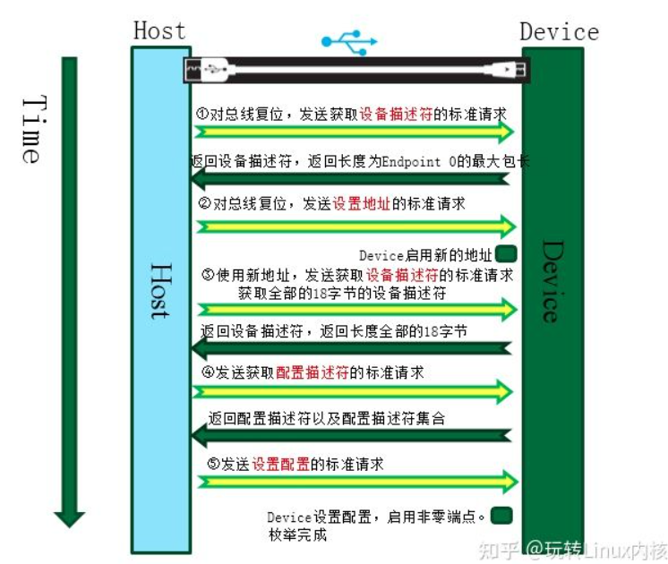
   >
   >##### USB包的使用
   >
   >​	包（Packet）是USB系统中信息传输的基本单元，所有数据都是经过打包后在总线上传输的。包括后边提到的事务（IN、OUT、SETUP等）和传输类型（控制、批量、中断、同步）都是基于包传输的，他们的关系是多个包组成一次事务，多次事务组成一次传输。
   >
   >1. 包
   >
   >  数据在 USB总线上的传输以包为单位，包只能在帧内传输。高速USB 总线的帧周期为125us，全速以及低速 USB 总线的帧周期为 1ms。帧的起始由一个特定的包（SOF 包）表示，帧尾为 EOF。EOF不是一个包，而是一种电平状态，EOF期间不允许有数据传输。
   >
   >  - 包是USB总线上数据传输的最小单位，不能被打断或干扰，否则会引发错误。若干个数据包组成一次事务传输，一次事务传输也不能打断，属于一次事务传输的几个包必须连续，不能跨帧完成。一次传输由一次到多次事务传输构成，可以跨帧完成。
   >
   >  - 包在总线上的情形
   >
   >    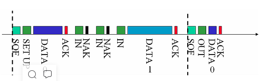
   >
   >  ​	USB协议传输过程都是以包为基准，任何数据都是一个数据包。包是USB总线上数据传输的最小单位，不能被打断或干扰，否则会引发错误。USB包由五部分组成，即同步字段（SYNC）、包标识符字段（PID）、数据字段、循环冗余校验字段（CRC）和包结尾字段（EOP），其中Frame Number和DATA为可选字段。
   >
   >  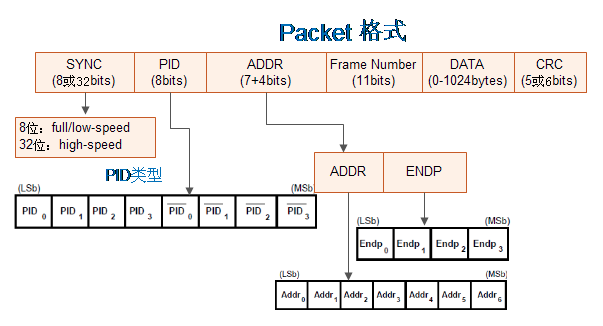
   >
   >​	**包类型（PID类型）：**
   >
   >​	这里的PID是USB数据包的PID字段，用来只是包的类型。如下：
   >
   >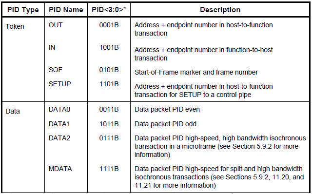
   >
   >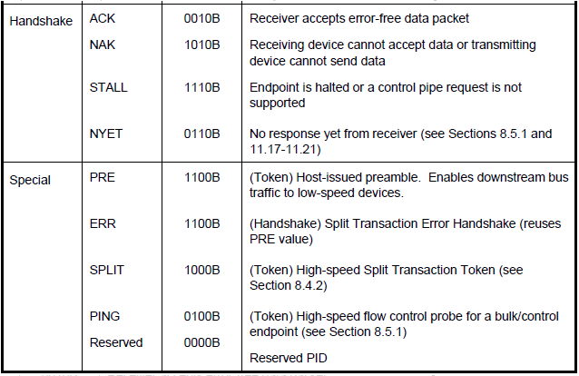
   >
   >**列举部分包格式**
   >
   >1. Token包
   >
   >   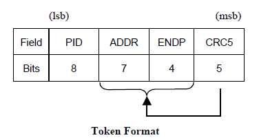
   >
   >   此格式适用于IN、OUT、SETUP、PING。
   >
   >2. SOF包（Start of frame）
   >
   >   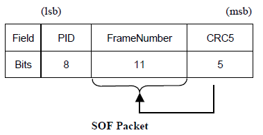
   >
   >   该包用来表示每帧的起始，全速/低速模式每帧周期1ms，高速模式每帧周期125us，虽然高速USB总线和全速/低速USB总线的帧周期不一样，但是SOF包中帧编号的增加速度是一样的，因为在高速USB系统中，SOF包中帧编号实际上取得是计数器的高11位，最低三位作为微帧编号没有使用，因此其帧编号的增加周期也为 1ms。
   >
   >3. Data包
   >
   >   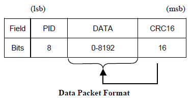
   >
   >   此格式适用于DATA0,DATA1,DATA2,MDATA。
   >
   >   DATA0和DATA1常用来作为数据同步，按照DATA0-DATA1-DATA0-DATA1的次序来同步数据
   >
   >4. Handshake包
   >
   >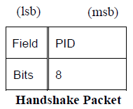
   >
   >​		此格式适用于ACK、NAK、STALL。
   >
   >​		ACK表示正常应答，NAK表示设备忙无法应答（实际还是应答了），STALL表示访问出错
   >
   >2. 事务
   >
   >   一个事务由多个包组成。不同类型的事务组成包类型不同。参考[这里](https://blog.csdn.net/myarrow/article/details/8484113)
   >
   >   2.1 输入IN事务
   >
   >   输入事务处理：表示USB主机从总线上的某个USB设备接收一个数据包的过程。
   >
   >   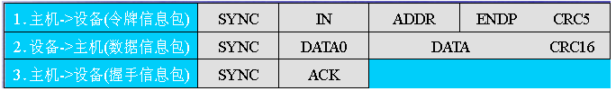
   >
   >   2.2 输出OUT事务
   >
   >   输出事务处理：表示USB主机把一个数据包输出到总线上的某个USB设备接收的过程。
   >
   >   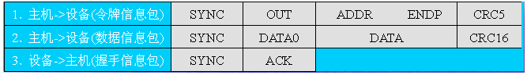
   >
   >   2.3 设置SETUP事务处理
   >
   >   设置事务处理：主机通过该事务来设置设备地址、选择设备配置等
   >
   >   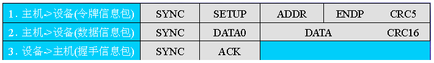
   >
   >##### USB传输类型
   >
   >   在USB的传输中，定义了4种传输类型：
   >
   >- 控制传输 (Control Transfer)
   >- 中断传输 (Interrupt Transfer)
   >- 批量传输 (Bulk Transfer)
   >- 同步传输 (Isochronous)
   >
   >1. 控制传输过程(Control Transfer)
   >
   >   分为Setup、Data、Status三个阶段，其中Data阶段由一个或多个IN/OUT事务组成。Status阶段是一次OUT/IN包，但数据段长度为0
   >
   >   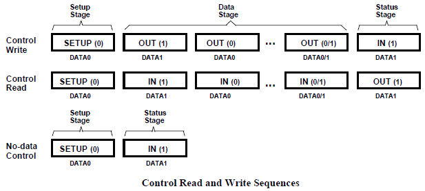
   >
   >2. 批量传输过程 (Bulk Transfer)
   >
   >   中断传输由IN或OUT事务组成（也就是N/OUT Token、Data、Handshake三种包）。 
   >
   >   在传输大量数据时可以分为一次或多次批量事务传输，每次传输完成后将会进行一次握手，并且使用DATA0-DATA1依次传输的方式来同步传输，传输失败3次后将放弃传输。
   >
   >   批量传输是可靠传输，要求传输不能出错，但对时间没有要求，适用于打印机、存储设备等。
   >
   >   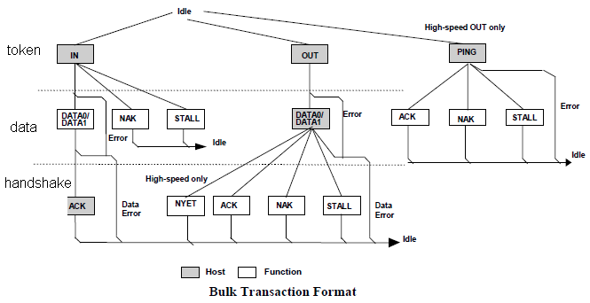
   >
   >3. 中断传输过程(Interrupt Transfer)
   >
   >   中断传输由IN或OUT事务组成。 
   >
   >   中断传输在流程上除不支持PING 之外，其他的跟批量传输是一样的。他们之间的区别也仅在于事务传输发生的端点不一样、支持的最大包长度不一样、优先级不一样等这样一些对用户来说透明的东西。主机在排定中断传输任务时，会根据对应中断端点描述符中指定的查询间隔发起中断传输。中断传输有较高的优先级，仅次于同步传输。
   >    同样中断传输也采用PID翻转的机制来保证收发端数据同步。下图为中断传输的流程图。
   >
   >    中断传输方式总是用于对设备的查询，以确定是否有数据需要传输。因此中断传输的方向总是从USB设备到主机
   >
   >4. 同步传输过程(Isochronous Transfer)
   >
   >   同步传输只由token和data两种包组成，不支持握手和重传能力，也不支持PID翻转（DATA0和DATA1切换），因此是不可靠传输。一般用于麦
   >   克风、喇叭、UVC Camera等设备。
   >
   >   


