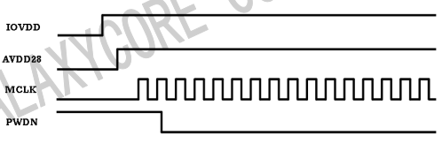
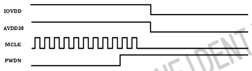

## 一、简述

调试0328摄像头需要使用两套协议：IIC和DVP，IIC协议用来读写摄像头内部的寄存器来控制摄像头的功能，DVP协议用来接收摄像头返回的图像数据。需要注意IIC协议是上位机作为主机，Sensor作为从机；DVP协议是上位机作为从机，Sensor作为主机。

## 二、协议调试

协议的调试过程：
1. 核对引脚连接
2. 实现正常启动和停止Sensor
3. 实现IIC通信并配置(调试)Sensor的功能
4. 基于DVP协议接收Sensor的数据

### 2.1 核对引脚连接

需要核对的引脚有：SCL、SDA、VSYNC、HSYNC、PCLK、D<7,0>、MCLK、RESET、PWDN、VDD、GND

- SCL、SDA：IIC协议的信号线，SCL是同步时钟线，SDA是数据线。
- VSYNC、HSYNC、PCLK、D<7,0>：DVP协议的信号线，VSYNC是帧同步信号(默认低电平有效)，HSYNC是行同步信号(默认低电平有效)、PCLK是同步时钟信号(默认下降沿有效)、D<7,0>是8根数据线。数据线的数据在PCLK有效(默认下降沿)时捕获。
- MCLK：Sensor的时钟源，需要外部提供，一般为24MHz。如果没有提供该时钟源Sensor将无法工作。
- RESET：Sensor的复位引脚，低电平有效，即低电平时进入复位状态。复位状态Sensor无法工作。(部分Sensor在内部已经将RESET跟PWDN接到一起，操作PWDN时同时可以对芯片复位)
- PWDN：Sensor的休眠脚，高电平进入休眠模式，低电平进入工作模式。休眠模式Sensor无法工作。
- VDD、GND：最后Sensor的电源和地，这部分引脚需要参考[数据手册](https://mangopi.cc/_media/gc0328c_datasheet_released_v1.0_20140930.pdf)的说明来连接。

### 2.2 实现正常启动和停止Sensor

Sensor在启动和停止时对MCLK、RESET、PWDN这三根信号线有一定的时序要求，有时候这部分时序是必要的，否则Sensor可能会无法正常工作。下面通过参考[数据手册](https://mangopi.cc/_media/gc0328c_datasheet_released_v1.0_20140930.pdf)提供的参考时序时序来启动和停止Sensor：

**1. 启动Sensor**

启动时序参考：

小结：
1. 拉高PWDN，拉低RESET，进入复位状态，延时50ms
2. 拉高RESET，退出复位状态
3. 开始输出MCLK时钟(24MHz左右),延时50ms
4. 拉低PWDN，进入工作模式
5. 开始IIC的操作

PS:
> 上面时序图中IOVDD、AVDD28是IO电源和主电源，实际应用中一般不方便控制，因此可以使用RESET来代替这个过程

**2. 停止Sensor**

停止时序参考：

小结：
1. 拉高PWDN，进入休眠模式
2. 停止输出MCLK时钟
3. 拉低RESET，进入复位状态

PS:
> 这里同理使用了RESET来代替IOVDD和AVDD28的功能

### 2.3 基于IIC协议向Sensor发起通信并配置(调试)Sensor的功能

使用IIC协议的前提需要正确的启动Sensor，否则Senor不能正常处理IIC数据。

**1. 实现IIC协议正常读写**

调试IIC时，一般保证以下情况后，IIC就可以正常读写：
1. 保证电路连接正常，主要参考数据手册
2. 保证Sensor正常启动，参考上一节的启动时序
3. 保证在IIC通信时，MCLK信号存在稳定时钟(一般24MHz左右)，且PWDN保持低电平，RESET保持高电平
4. 保证IIC时序正确，可以通过逻辑分析仪来判断和分析

**2. 配置Sensor的功能**

配置Sensor的功能也就是通过IIC通信来读写Sensor的寄存器。一般情况各类Sensor都会使用一个寄存器初始化序列来更新Sensor的默认配置，这个序列包括了Sensor各个寄存器的地址和值。每次启动摄像头之后都需要更新Sensor的配置。

关于Sensor的寄存器对应功能：

> 待补充

### 2.4 实现IIC通信并配置(调试)Sensor的功能

当Sensor的寄存器正确配置后，Sensor会开始捕获图像，每捕获一帧图像后通过DVP协议先按字节发送，直到发送完一行，再切换到下一行继续发送，直到发送完一帧图像后Sensor开始捕捉下一帧图像，捕捉完后再循环上面的步骤。这个过程由Sensor主动控制。

关于DVP协议涉及的信号线VSYNC、HSYNC、PCLK、D<7,0>的说明如下：
- D<7:0>：Sensor发送一个字节数据时，会将D<7,0>的引脚电平设置为与该字节对应的值。
- PCLK：Sensor发送完一字节数据后，会将PCLK引脚拉低来表示一字节数据发送完成。
- HSYNC：Sensor发送一帧数据的过程中，发送完这帧数据的某一行，会将HSYNC引脚拉低来表示一行数据已经发送完成。
- VSYNC：当Sensor发送完一帧数据后，会将VSYNC引脚拉低来表示一帧数据已经发送完成。

接收DVP数据的细节：

> 待补充

小节：
1. Sensor每捕获到一张图像就会主动下发图像，一张图像被称为一帧图像
2. Sensor发送图像的方式为：从起始行(默认从下往上)开始，每发送一字节将PCLK拉低；每发送完一行数据将HSYNC拉低，并默认开始发送下一行数据，直到一帧数据发送完；每发送完一帧数据，将VSYNC拉低，并开始捕获下一帧数据。

PS:
> 1. 需要注意在接收Sensor数据时，所有信号线的状态都是被动接收的，也就是说VSYNC、HSYNC、PCLK、D<7,0>对应引脚都会配置为输入模式，此时Sensor占有DVP时序的控制权。
> 2. 关于DVP IO有关的寄存器：
> 寄存器P0:0x24，配置HSYNC、VSYNC、D<7:0>、PCLK的输出驱动能力；
> 寄存器0xf1，使能VSYNC、HSYNC、PCLK输出；
> 寄存器0xf2，使能D<7,0>输出；
> 寄存器P0:0x46，配置VSYNC(默认低电平有效)、HSYNC(默认低电平有效)、PCLK极性(默认下降沿有效)。

