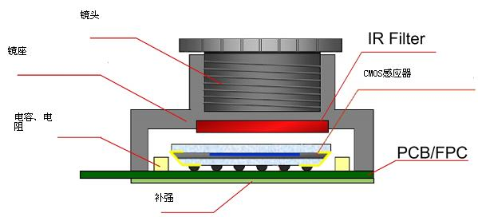
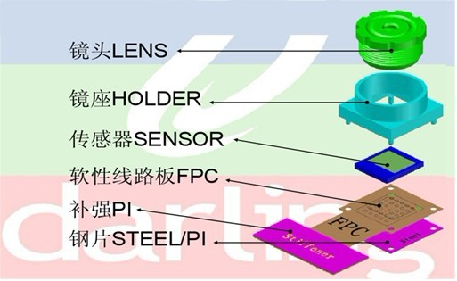
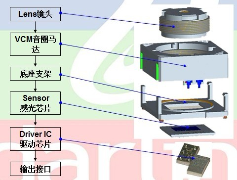

## 摄像头模组

[camera理论基础和工作原理](https://www.cnblogs.com/fjutacm/p/220631977df995512d136e4dbd411951.html)

[CMOS Sensor的调试经验分享](https://www.cxybb.com/article/qq_23260897/79621010)

[camera sensor 摄像头 效果调试](https://wenku.baidu.com/view/83448db0f524ccbff1218476.html)

[Camera基础知识](https://www.cnblogs.com/rockyching2009/p/14681222.html)

[ISP（图像信号处理）算法概述、工作原理、架构、处理流程](https://aijishu.com/a/1060000000224101)

摄像头模组简介：

1. 摄像头模组(Camera Compact Module)，简写为CCM。即使是手机厂商，一般也是使用摄像头模组进行开发，所以不需要投入太大精力到摄像头光信号到模拟信号，再到数字信号的实现过程，只要知道原理即可。
2. 摄像头组成视图

    一张外界的图片，通过镜头传入，再经过红外滤光后传到CMOS或CCD感应器，感应器将光信号转换为模拟信号并进行模拟信号处理(包含通过CDS进行降噪)，随后将处理过的模拟信号通过ADC转化为数字信号，数字信号经过DSP加工处理后转为YUV/RGB/JPG等格式输出。

3. 摄像头模组的组装方式
- 定焦模组的装配，主要由镜头、镜座、感光集成电路、软性线路板、补强和钢片装配而成，其装配图如下：
    

- 自动变焦模组的装配方式，有一个音圈马达(VCM)来控制焦距。

    关于VCM：全称Voice Coil Montor，电子学里面的音圈电机，是马达的一种。因为原理和扬声器类似，所以叫音圈电机，具有高频响、高精度的特点。其主要原理是在一个永久磁场内，通过改变马达内线圈的直流电流大小，来控制弹簧片的拉伸位置，从而带动上下运动。手机摄像头广泛的使用VCM实现自动对焦功能，通过VCM可以调节镜头的位置，呈现清晰的图像。参考自[这里](https://zhuanlan.zhihu.com/p/37332613)。

    

4. basebaud芯片

    基带(basedaud)芯片负责图片数据处理与储存，相当于一个协处理器，主要组件为DSP、微控制器、内存（如SRAM、Flash）等单元，主要功能为基带编码/译码、声音编码及语音编码 等。

5. DSP(Data Signal Processor)，数字信号处理器

	DSP用来处理各种数字信号，包括拍照以及回显（JPEG的编解码）、录像以及回放（Video 的编解码）、H.264的编解码、还有很多其他方面的处理。

6. ISP(Image Signal Processor)，图像信号处理器

	ISP用来处理Sensor输出的数据，进行AEC(自动曝光控制)、AGC（自动增益控制）、AWB（自动白平衡）、色彩校正、Gamma校正、祛除坏点、自动黑平衡(Auto Black Level)、自动白平衡(Auto White Level )等等功能的处理。可以认为ISP是一类特殊的处理图像信号的DSP。

6. 关于摄像头的一些技术指标

- 图像格式(RGB/YUV/JPG),其中RGB格式通过红/绿/蓝三种颜色来表示像素；YUV通过Y表示像素的亮度，UV表示像素的色度；JPG是一种图片压缩格式，部分camera的DSP支持JPG压缩，想要显示JPG图片还需要将JPG解码再发送到framebuffer。

- Sensor的类型：CMOS和CCD

    CMOS（Complementary Metal-Oxide Semiconductor），互补性氧化金属半导体：主要是利用硅和锗做成的半导体，使其在CMOS上共存着带N(-)和P(+)级的半导体，这两个互补效应所产生的电流可以被处理芯片记录并解读成影像。CMOS传感器主要以美国、韩国和中国台湾为主导，主要生产厂家是美国的OmnVison、Agilent、Micron，中国台湾的锐像、原相、泰视等，韩国的三星、现代。

    CCD（Charge Coupled Device），电荷耦合器件传感器：使用一种高感光度的半导体材料制成，能把光线转变成电荷，通过模数转换器芯片转换成电信号。CCD由许多独立的感光单位组成，通常以百万像素为单位。当CCD表面受到光照时，每个感光单位都会将电荷反映在组件上，所有的感光单位产生的信号加在一起，就构成了一幅完整的图像。CCD传感器以日本厂商为主导，全球市场上有90%被日本厂商垄断，索尼、松下、夏普是龙头。

- 自动白平衡(AWB)

    首先在不同环境下的色温是不同的，不同色温环境下的颜色是有偏差的，在色温偏红的环境下，白纸的颜色会偏红；色温偏蓝的环境下，白纸的颜色会偏蓝，一般不会考虑绿色。自动白平衡就是将不同色温环境下"变色的白纸"颜色自动调节为"白色"

- 色彩深度

    像素占用数据的bit数，RGBA8888格式每个像素占用32位，即色彩深度为32；RGB888格式每个像素占用24位，即色彩深度为24；RGB565格式每个像素占用16位，即色彩深度为16

- 图像噪音

    图像中一些固定
   **MIPI接口**
    MIPI联盟，即移动产业处理器接口（Mobile Industry Processor Interface 简称MIPI）联盟。MIPI摄像头有三个电源：VDDIO（IO电源），AVDD（模拟电源），DVDD（内核数字电源），不同sensor模组的摄像头供电不同，AVDD有2.8V或3.3V的；DVDD一般使用1.5V或更高，不同厂家的设计不同，1.5V可能由sensor模组提供或外部供给，可以使用外部供电则建议使用外部供，电压需大于内部的DVDD；VDDIO电压应与MIPI信号线的电平一致，若信号线是2.8V电平，则VDDIO也应供2.8V，有些sensor模组也可以不供VDDIO，由内部提供。
    MIPI的Camera接口叫CSI，Display接口叫DSI
    参考自[这里](https://blog.csdn.net/quicmous/article/details/114922463)

    **DVP**
    DVP是并口发送，且需要引脚有PCLK、VSYNC、HSYNC、D[0：11]，其中PCLK最大约96MHz，通常控制在72M以下。一般情况最大勉强支持500w像素，超过800w像素时使用MIPI接口。
    
    **CSI**
    CSI接口时MIPI联盟提供的，用来应对传统camera接口逻辑复杂，容易收到干扰等问题。

    ## DVP协议

    有3个同步时钟：
        帧同步时钟(VSYNC):低电平有效(可以配置)。在发送图片帧期间保持低电平，即下降沿开始传输图片帧；没有发送帧时保持高电平，即上升沿停止传输图片帧。
        行同步时钟(HSYNC):高电平有效。在发送一行(DVP一行有648字节)数据期间保持高电平，即上升沿开始传输行数据；没有发送一行数据时保持低电平，即下降沿停止传输行数据。
        像素点同步时钟信号(PCLK): 像素数据是通过并口发送，每字节像素数据会有一个像素同步时钟，一般情况是在上升沿主机捕获数据。

        
计算曝光时间值：

计算不影响帧时间的方式
方法一：直接通过示波器捕获一帧图片的传输时间，保证exp_time不大于一帧的传输时间，这里一帧不包括VSYNC无效的时间

方法二：通过时钟计算
exp_time_max = win_height + VB      // win_height 由寄存器P0x0:0x0d P0:0x0e设置，VB由寄存器P0:0x07 P0:0x08设置

