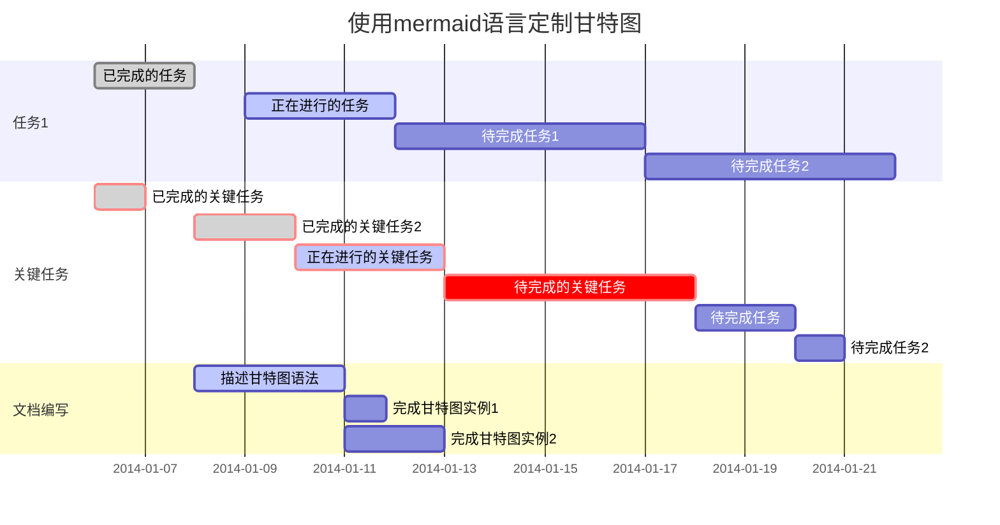

# 用markdown画甘特图

```mermaid
gantt         
dateFormat  YYYY-MM-DD   
title 使用mermaid语言定制甘特图

section 任务1
已完成的任务		 :done,    des1, 2014-01-06,2014-01-08
正在进行的任务	    :active,  des2, 2014-01-09, 3d
待完成任务1		  :         des3, after des2, 5d
待完成任务2 		  :         des4, after des3, 5d

section 关键任务
已完成的关键任务 	:crit, done, 2014-01-06,24h
已完成的关键任务2    :crit, done, after des1, 2d
正在进行的关键任务   :crit, active, 3d
待完成的关键任务     :crit, 5d
待完成任务          :2d
待完成任务2         :1d

section 文档编写
描述甘特图语法       :active, a1, after des1, 3d
完成甘特图实例1      :after a1  , 20h
完成甘特图实例2      :doc1, after a1  , 48h
```